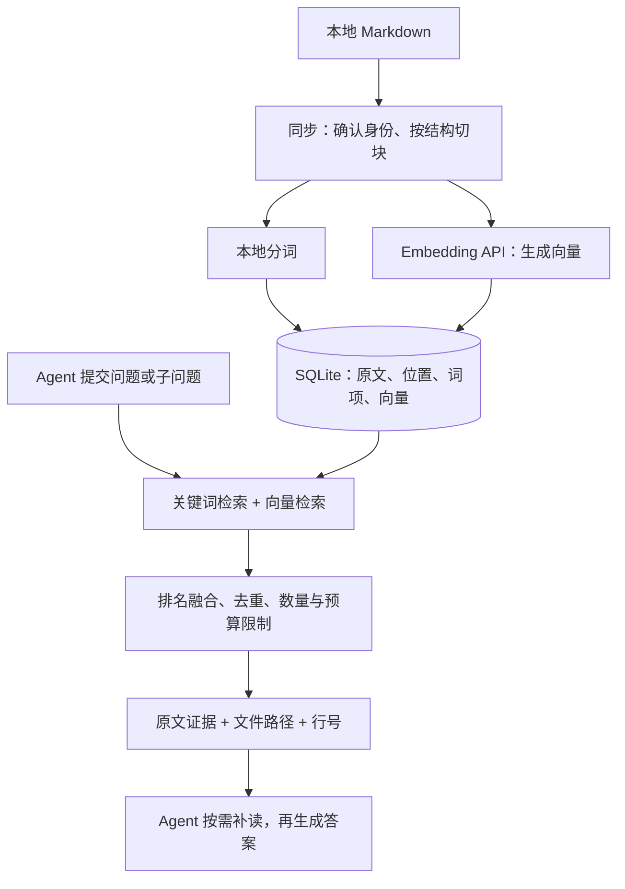

<table width="100%">
  <tr>
    <td width="61.8%" valign="top">
      <h1>Echo</h1>
      <p><strong>专注个人 Markdown 知识库的轻量 MCP Retrieval Engine。</strong></p>
      <p>让你的笔记、学习记录和个人资料成为 Agent 随时可查的知识库。Echo 帮你找到相关原文及出处，让回答有据可依。</p>
      <p>开箱即可使用经过评测的默认检索方案，同时支持高度自定义。你可以根据自己的资料和使用习惯调整策略，并通过评测找到更适合自己的配置。</p>
      <p>
        <a href="#快速开始">快速开始</a> ·
        <a href="#请求与返回">请求与返回</a> ·
        <a href="#架构与检索流程">架构</a> ·
        <a href="#评测结果">评测</a> ·
        <a href="#配置与扩展">配置</a> ·
        <a href="#开发与验证">开发</a>
      </p>
      <h2>用 Echo 做什么</h2>
      <ul>
        <li><strong>找回写过的知识</strong>：从笔记、课程资料和学习记录中找到相关内容，不必记住文件名或原文措辞。</li>
        <li><strong>让回答有出处</strong>：检索结果附带原文、文件路径和行号，方便 Agent 核对、补读与引用。</li>
        <li><strong>检索复杂问题</strong>：支持 Agent 提交多个子问题，从不同资料中寻找所需证据。</li>
        <li><strong>管理自己的知识库</strong>：多份知识库可以分别保存配置与索引，共用一次程序安装。</li>
        <li><strong>调整到适合自己</strong>：从默认方案开始，按资料特点更换模型、调整检索参数，或编写自己的切块与分词策略。</li>
      </ul>
      <p>Echo 负责检索和返回证据；问题拆解、证据判断与回答生成由 Agent 完成。</p>
    </td>
    <td width="38.2%" align="center" valign="middle">
      
    </td>
  </tr>
</table>

## 快速开始

```sh
npm install -g @huanf/echo@0.1.0
```

默认混合检索需要外接 **Embedding 模型**，配置服务地址、模型、向量维度和 API key。无需下载本地模型。

把下面这段话发给能操作本地文件和终端的 Agent，让它完成配置：

> 请阅读并按照 [Echo Agent 配置指南](https://github.com/HuanHuanHuanFFF/Echo/blob/main/docs/guides/agent-setup.md) 帮我配置 Echo MCP。先在当前工作目录完成初始化和能自动完成的配置，保留已有设置。需要我提供的笔记目录、Embedding 服务、模型、API key 或客户端操作，请在本地准备完成后一次性告诉我；已有信息直接复用。条件齐全后完成同步、MCP 接入和一次真实检索验证，并说明实际完成情况。

> 发布准备中：npm 安装命令在 `@huanf/echo@0.1.0` 正式上架后可用。

## 请求与返回

调用 MCP 工具 `echo_search`：

```json
{
  "query": "事务失败后怎样回滚？"
}
```

下面是响应的业务 JSON 示例，位于 MCP `content[0].text` 中。笔记内容与路径为虚构示例；为突出接口结构，省略 `chunk_id`、`source_id` 和 `source_version`。

```json
{
  "status": "ok",
  "results": [
    {
      "collection_id": "notes",
      "path": "/knowledge/notes/database/transactions.md",
      "heading_path": ["数据库", "事务回滚"],
      "start_line": 12,
      "end_line": 13,
      "section_start_line": 10,
      "section_end_line": 18,
      "text": "事务执行失败时，使用 undo log 撤销未提交的修改。\n应用层重试需保证幂等，避免重复执行。",
      "matched_query_ids": ["q0"]
    }
  ],
  "queries": [
    {
      "query_id": "q0",
      "status": "ok",
      "returned": 1
    }
  ]
}
```

行号从 1 开始，两端包含。Agent 可以直接使用返回的证据，也可以按绝对路径和章节范围，通过宿主文件工具补读。`status: ok` 表示检索执行成功，不代表证据足够回答问题。

## 架构与检索流程

TypeScript + 嵌入式 SQLite，MCP 使用 stdio。关键词检索在本地执行，Embedding 通过用户配置的 API 生成，无需独立数据库服务。



1. **同步与切块**：以 UUID v4 标识来源，检测内容和路径变化；按 Markdown 结构切块，保存原文行号与章节范围。
2. **双路召回**：默认使用本地 ICU 分词与 MiniSearch BM25 词法评分；向量存储与相似度检索使用 SQLite / sqlite-vec。MiniSearch 运行时索引驻留进程内存，由本地持久化数据构建并缓存。
3. **融合与打包**：两路候选通过加权 RRF 融合，去重后同时应用 `topk`、`max_chunks_per_source` 与完整响应 JSON 预算。
4. **证据消费**：Echo 返回原文证据和定位。Agent 判断证据是否充分、按需补读并生成答案。

[架构图与模块职责](docs/architecture/README.md) · [配置与索引依赖](docs/design/configuration-profiles.md)

## 评测结果

默认方案经过个人笔记、学习资料与公开数据集评测。以下为当前采用方案对应的自建题集冻结结果：

| 指标         |                      结果 |
| ------------ | ------------------------: |
| 题集规模     | 200 题，其中 196 题可回答 |
| 完整证据覆盖 |   **190 / 196（96.94%）** |
| 标注事实覆盖 |   **393 / 403（97.52%）** |

**完整证据覆盖**表示返回内容覆盖了一道题所需的全部标注证据；**标注事实覆盖**表示所有标注事实中，有多少被返回内容覆盖。

这组题集已用于调参与分析，结果反映固定条件下的检索效果，不是独立盲测，也不等同于 Agent 回答正确率。更换资料、模型或返回预算后，效果可能变化。

| 评测资料                                                                                                                            | 内容                                     |
| ----------------------------------------------------------------------------------------------------------------------------------- | ---------------------------------------- |
| [个人知识库 200 题](docs/evals/2026-09-21-default-budget20-cap-comparison.md)                                                       | 分库结果、事实覆盖、上下文用量与参数条件 |
| [公开数据集全量评测](docs/evals/2026-09-22-cap6-public-full-results.md)                                                             | 不同资料类型上的检索表现与取舍           |
| [QMD 私有题集对照](docs/evals/2026-09-25-qmd-private-comparison.md)                                                                 | 个人知识库场景对照与实验条件             |
| [QMD 公开固定单元对照](docs/evals/2026-09-26-qmd-public-fixed-results.md)                                                           | 保留官方检索单元的排名对照               |
| [Agent 接口复验](https://github.com/HuanHuanHuanFFF/Echo/blob/codex/npm-release-preparation/docs/evals/2026-09-26-agent-recheck.md) | 实际 MCP 调用、定位、新鲜度与错误反馈    |

公开固定单元的排名评测与个人知识库的端到端证据覆盖采用不同口径，请结合各报告中的条件阅读。

[查看评测与文档索引](docs/README.md)

### 在自己的知识库上评测

使用脚本冻结语料、查询与证据标签，比较 BM25、dense、hybrid 或自定义参数；记录证据覆盖、排名、延迟和累计上下文，无需逐题运行完整 Agent。

```sh
npm run eval:retrieval -- --help
```

比较时固定语料、Embedding、题集和上下文预算，明确哪些数据已用于调参。公开固定单元评测可用于比较排序，不能直接证明重新切块的收益。

[评测接口与题集格式](docs/design/retrieval-evaluation.md)

## 配置与扩展

### 默认检索配置

| 层级      | 当前默认                                                                                     |
| --------- | -------------------------------------------------------------------------------------------- |
| Chunking  | `markdown-structure-v1@1.0.1`：目标 1000、常规最大 1500 字符；超长单元回退时 overlap 80 字符 |
| Tokenizer | `icu-zh@1`，本地分词，无额外词典                                                             |
| Lexical   | MiniSearch，`k=1.2`、`b=0.7`、`d=0.5`；取消匹配词数量乘数，标题 / 正文权重 `2 / 1`           |
| Retrieval | `hybrid`；BM25 / dense 各取 60 个候选，最低向量余弦相似度 `0.3`                              |
| Fusion    | RRF `k=10`，BM25 / dense 权重 `0.5 / 1`                                                      |
| Packing   | `topk=10`，单篇最多 6 块，完整业务响应 JSON 预算 20,000 个 UTF-16 码元                       |
| Embedding | 服务、模型与维度由用户配置，不绑定提供方                                                     |

Chunk 尺寸是结构切分的软约束，overlap 只用于超长单元回退，不是每个块都重复前文。返回预算包含正文和元数据，不是 token 数量；数量不足时返回实际结果，不放宽约束补满。

[完整默认与适用边界](docs/project/2026-09-26-final-default-profile.md)

### 按职责拆分配置

```text
echo.config.json              # 主入口：路径与活动配置 ID
config/
  sources.json                # 笔记集合、扫描范围与大小限制
  embedding/default.json      # 模型、维度、API 地址与调用参数
  retrieval/balanced.json      # 召回、融合与响应预算
  runtime.json                # 并发与超时
  logging.json                # 日志级别、位置与轮转
chunkers/
  markdown-structure-v1.mjs    # 固定切块策略实现
tokenizers/
  icu-zh.mjs                   # 分词策略实现
.echo/
  index.sqlite                # 本地索引
```

- **策略可替换**：切块与分词通过 `.mjs` 接口加载；实现文件名与策略 ID 一致。切块规则固定，改变规则或数值应使用新的策略 ID。
- **配置可组合**：Embedding 与 retrieval 可分别保存多份 JSON，通过主入口选择；模型、维度和文本处理设置决定对应向量索引的身份。
- **索引按依赖复用**：仅调整召回参数无需重建索引；更换分词不需要重新切块或生成向量；新切块策略或模型按需建立对应索引。
- **工作区可隔离**：不同目录默认分别保存配置和 SQLite 数据库。主动指向同一路径可以共享资源；同目录仅更换主配置文件名不构成隔离。

### 切换与单次覆盖

```sh
echo-mcp config list
echo-mcp config show
echo-mcp config use --retrieval my-profile
```

先保存对应的 `my-profile.json` 再切换。切块、分词、模型和召回配置在 MCP 下一请求生效，在途请求保留原配置快照；切换不会隐式创建索引。数据库位置与运行参数变化需要重启服务。

单次 `echo_search` 可以覆盖少量参数：

```json
{
  "query": "事务失败后怎样回滚？",
  "filters": {
    "collections": ["notes"],
    "path_prefix": "database/"
  },
  "overrides": {
    "topk": 5,
    "max_chunks_per_source": 2
  }
}
```

优先级为 **内置默认 → 当前召回配置 → 本次 overrides**。未传字段保留配置值，`path_prefix` 相对 collection 根目录解析。

[配置 Schema、策略接口与迁移](docs/design/configuration-profiles.md)

## 开发与验证

开发环境：Node.js `>=24.15.0 <25`，npm 11。已验证 Windows x64 / Linux x64。

```sh
npm ci
npm run check
```

发布准备分支还提供实际安装包验证：

```sh
npm run smoke:package
```

`check` 覆盖路径规范、格式、类型、隔离测试、构建和默认 CLI/MCP 冒烟验证；安装包检查将 tarball 安装到独立目录，验证命令入口、原生依赖与 MCP 调用。Windows / Linux CI 执行这些检查，普通检查不依赖个人笔记或模型密钥。

| 目录        | 职责                                    |
| ----------- | --------------------------------------- |
| `src/`      | 同步、策略、存储、检索、CLI 与 MCP 实现 |
| `tests/`    | 隔离 Markdown / 临时数据库回归          |
| `examples/` | 配置与策略示例                          |
| `evals/`    | 检索评测脚本、评分器与固定样本          |
| `docs/`     | 使用指南、设计契约、实验报告与历史记录  |

[文档索引](docs/README.md) · [开发与历史实验](https://github.com/HuanHuanHuanFFF/Echo/blob/codex/npm-release-preparation/docs/history.md)

## License

Echo 自有代码采用 [MIT License](https://github.com/HuanHuanHuanFFF/Echo/blob/codex/npm-release-preparation/LICENSE)。第三方代码与资料保留各自许可。
